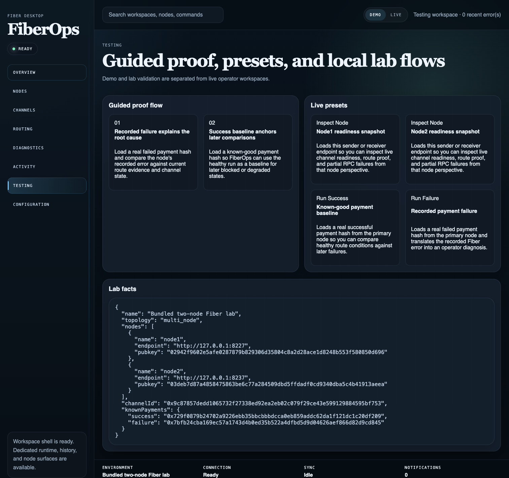
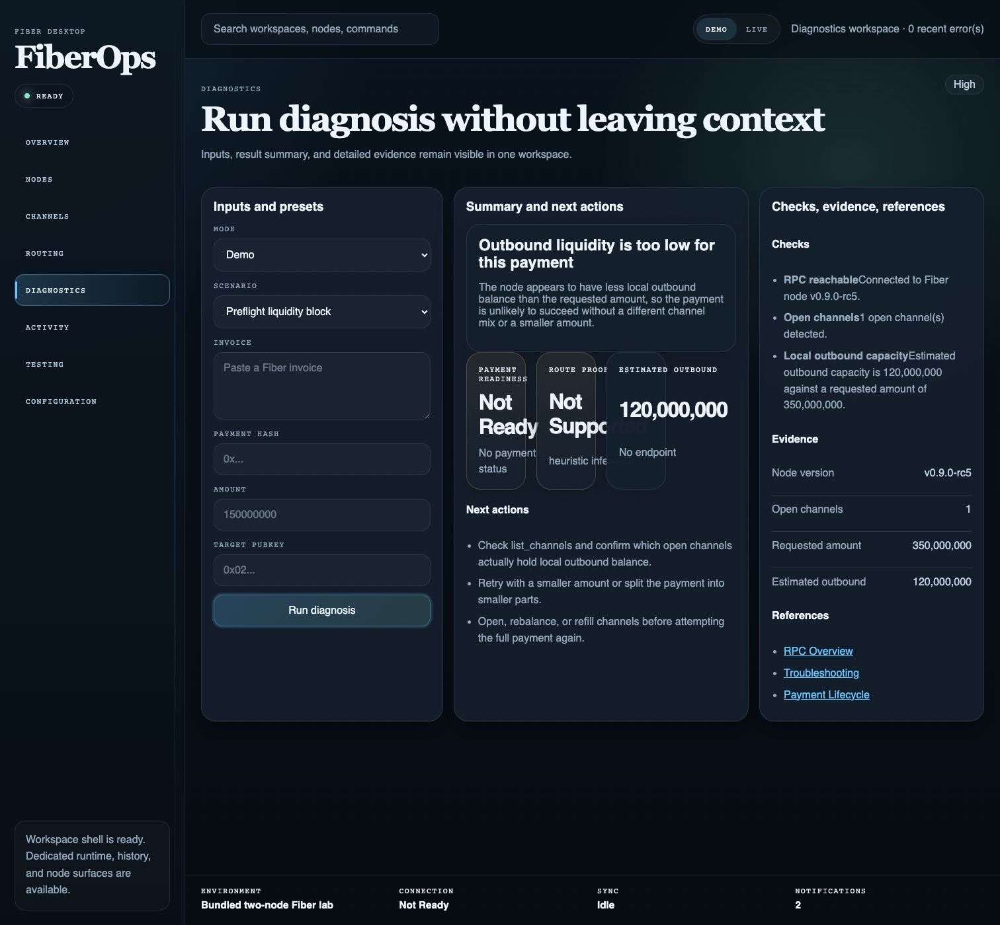
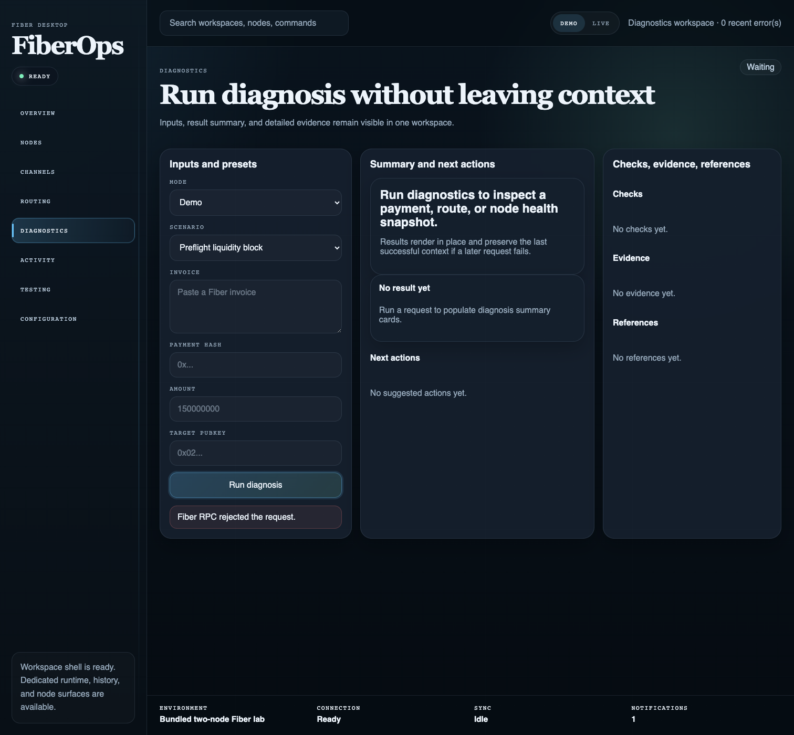
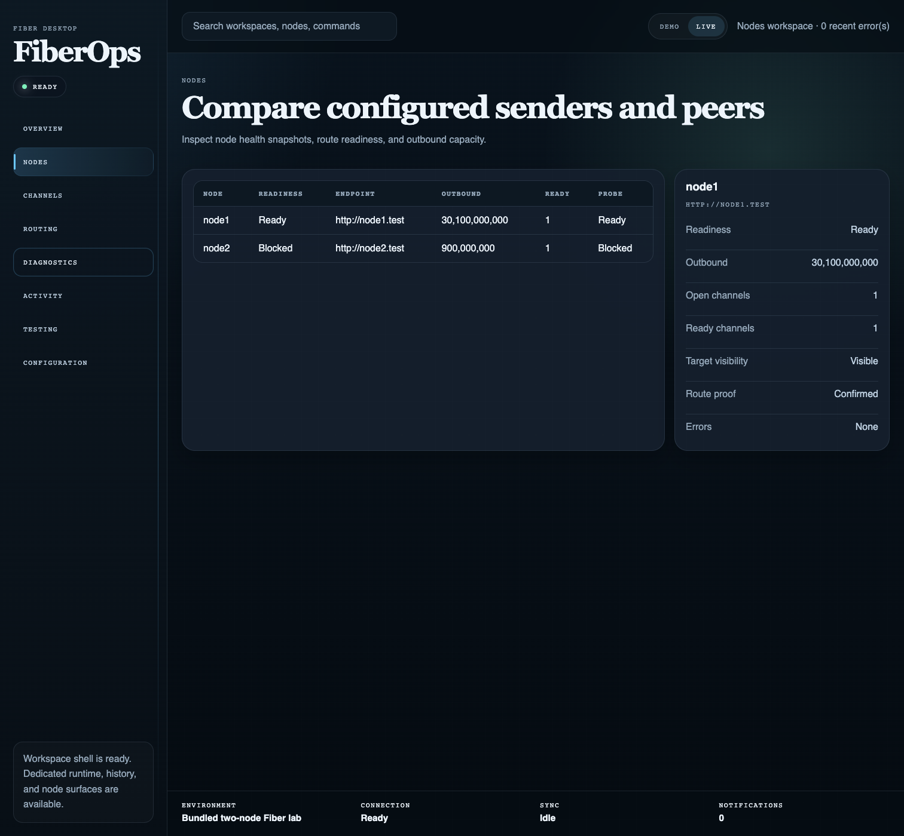

# FiberOps | Fiber Desktop on CKB Operator Console

FiberOps is the diagnostics engine and repository behind **Fiber Desktop**, a read-only operator console for Fiber on CKB. It turns raw node state into an operator-friendly explanation of what failed, what evidence is real, and what to do next.

## Problem

Fiber payments do not fail in a way that is easy for operators, hackathon judges, or backend developers to understand.

When a payment breaks, the root cause is usually scattered across low-level RPC reads such as channel state, outbound liquidity, graph visibility, invoice validity, payment lifecycle state, and route-readiness evidence. That creates a practical gap:

**Fiber has the raw signals, but not an operator-first diagnostic surface that turns those signals into an actionable explanation.**

FiberOps exists to close that gap.

## Solution

FiberOps provides a single diagnostics engine through four surfaces:

- **Browser UI** for demos and operator workflows
- **HTTP API** for backend integration
- **CLI** for scripted diagnostics
- **Library exports** for embedding in other tools

It is designed to answer a small set of operational questions clearly:

- What failed?
- Why did it fail?
- Is the route currently ready?
- Is that conclusion based on real, heuristic, or fixture evidence?
- Do multiple live nodes agree on the result?
- What should the operator do next?

Fiber Desktop is not a wallet and not a payment sender UI. It is operator software for understanding Fiber routing behavior safely.

The current desktop shell is organized around a small set of primary workspaces:

- **Overview** for health, changes, and next actions
- **Nodes** for sender posture and live node comparison
- **Payments** for history, retries, and failure clusters
- **Routes** for candidate path analysis
- **Diagnostics** for deep failure explanation
- **Settings** for observation defaults and runtime safety

Supporting flows such as **Simulations**, **Activity replay**, **Logs**, and **Reports** are still available, but they are treated as contextual investigation tools rather than the first thing a judge or operator has to navigate.

Key architectural properties:

- live execution resolves the actual node set first, validates every resolved node against policy, then runs diagnosis
- per-node diagnosis is computed before aggregate selection, so the top-level result stays anchored to a selected node instead of mixing evidence from different senders
- route evidence is explicit: heuristic, invoice dry run, keysend-style dry run, or opt-in deep route-build analysis
- history persistence is behind a backend seam with a compatible JSON backend and an append-safe NDJSON backend

## Screenshots

### Guided proof flow



### Blocked route diagnosis



### Degraded RPC failure state



### Multi-node comparison



## Quick start

### Prerequisites

- Node.js 20+
- npm
- Playwright Chromium for browser smoke coverage

### Local lab flow

```bash
npm ci
npm run lab:reset
npm run lab:prepare
npm run lab:check
npm run dev
```

Open `http://localhost:3000`.

For local configuration templates, see `.env.example` and `examples/live-node-set.json`.

## Usage overview

### Browser UI

Use the browser app to:

- open the current network overview first
- jump directly into node, payment, route, or diagnostics workflows
- run one-click demo scenarios from `Simulations`
- inspect live node readiness
- compare multi-node perspectives
- review route preview evidence
- replay backend history when enabled
- switch between auto, light, and dark themes during review

### Demo scenarios

The current `Simulations` workspace includes one-click scenario buttons for reliable demos:

- `Healthy Payment`
- `Low Liquidity`
- `Offline Node`
- `Fee Budget Too Low`
- `Route Not Found`

These are intended for presentations and judging. They remove the risk of trying to recreate a failure live while an audience is watching.

### HTTP API

Main endpoints:

- `GET /api/bootstrap`
- `POST /api/diagnose`
- `GET /api/health`
- `GET /api/metrics`
- `GET /api/contracts/diagnose`
- `GET /api/contracts/diagnose/request`
- `GET /api/contracts/diagnose/result`
- `GET /api/contracts/diagnose/rules`

All routes return explicit envelopes:

- success: `{ ok, data, meta }`
- failure: `{ ok, error, meta }`

Example request:

```bash
curl -X POST http://127.0.0.1:3000/api/diagnose \
  -H 'content-type: application/json' \
  -d '{
    "mode": "demo",
    "scenarioId": "preflight-liquidity-block"
  }'
```

Optional live-analysis fields:

- `analysisDepth`: `standard` or `deep`
- `outputMode`: `full`, `machine`, `operator`, `backend`, or `wallet`

`standard` keeps live diagnosis fast and compatible. `deep` opt-ins to `graph_channels` and `build_router` analysis.

### CLI

```bash
npm run diagnose -- --mode demo --scenario-id route-build-failure
npm run diagnose -- --mode demo --scenario-id preflight-liquidity-block --output-mode operator
npm run diagnose -- --mode live --endpoint http://127.0.0.1:8227 --amount 10000000000 --target-pubkey <pubkey> --analysis-depth deep
cat payload.json | npm run diagnose -- --output-mode backend
```

### Library

```js
import {
  runDiagnosis,
  formatDiagnosisOutput,
  validateDiagnosisRequest
} from "fiberops/diagnostics";
```

## Documentation index

Start here:

- [Developer guide](docs/developer-guide.md) — contributor and integrator overview
- [Architecture](docs/architecture.md) — system structure and request flow
- [Contracts](docs/contracts.md) — request, result, and compatibility model
- [Runtime model](docs/runtime-model.md) — evidence tiers and runtime semantics
- [Failure modes](docs/failure-modes.md) — diagnosis taxonomy and operator actions
- [Local lab runbook](docs/local-lab-runbook.md) — prepare and operate the bundled lab
- [End-to-end validation](docs/e2e-validation.md) — validation paths for UI, API, and live lab workflows
- [Judge demo narrative](docs/judge-demo.md) — story-first presentation flow for demos and judging
- [Release process](docs/release-process.md) — release checklist and tagging flow

Suggested reading paths:

- **New to FiberOps:** README -> Developer guide -> Architecture
- **Integrating the API:** README -> Developer guide -> Contracts -> Runtime model
- **Running the local lab:** README -> Local lab runbook -> End-to-end validation
- **Debugging a failure:** README -> Failure modes -> Runtime model -> Contracts
- **Presenting to judges:** README -> Judge demo narrative -> End-to-end validation

## Contributing

Contribution workflow and repository policy live in [CONTRIBUTING.md](CONTRIBUTING.md).

Before opening a pull request:

1. describe the operator problem being solved
2. keep the change focused and evidence-driven
3. run `npm run test:all`
4. run `npm run check`
5. update docs, examples, and screenshots when user-facing behavior changes

## Release

Release guidance lives in [docs/release-process.md](docs/release-process.md).

## License

FiberOps is licensed under the Apache License, Version 2.0. See [LICENSE](LICENSE).
