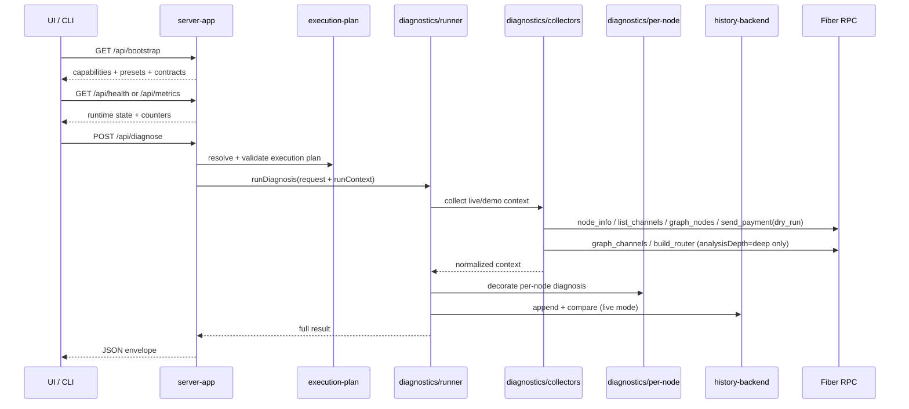

# Architecture

## Related docs

- [Developer guide](./developer-guide.md)
- [Contracts](./contracts.md)
- [Runtime model](./runtime-model.md)
- [Failure modes](./failure-modes.md)
- [End-to-end validation](./e2e-validation.md)

FiberOps is structured as a thin UI plus HTTP shell around a reusable diagnostics package.

At the product layer, the current browser shell presents that engine as FiberOps itself: a workflow-oriented operator client with a compact primary navigation set and contextual investigation surfaces.

## Component diagram

```mermaid
flowchart LR
  UI[Browser UI\npublic/index.html\npublic/app.js] --> API[server-app\nsrc/lib/server-app.js]
  CLI[CLI\nsrc/cli.js] --> DIAG[Diagnostics package\nsrc/lib/diagnostics]
  API --> DIAG
  DIAG --> RPC1[Fiber RPC node1]
  DIAG --> RPC2[Fiber RPC node2]
  DIAG --> HIST[History backend seam\nsrc/lib/history-store.js]
  API --> OBS[In-process observability\nsrc/lib/observability.js]
  API --> CONTRACTS[/api/contracts/diagnose*]
```

## Request and data flow



## How diagnosis is computed

1. `server/execution-plan.js` resolves the exact live node set that will be contacted and validates policy against that resolved set.
2. `runner.js` selects `demo` or `live` execution.
3. `collectors.js` gathers node snapshots and optional route evidence.
4. `per-node.js` computes per-node diagnosis, route preview, and alerts before aggregate selection.
5. `classifiers.js` converts evidence into a category, headline, explanation, actions, and references.
6. `summaries.js` shapes readiness, monitoring, and comparison fields.
7. `engine.js` keeps the route-preview façade and assembles route-readiness output.
8. `events.js`, `history.js`, and `recommendations.js` attach event envelopes, history transitions, and operator alerts.
9. `adapters.js` exports the canonical result into `machine`, `operator`, `backend`, and `wallet` views.

## Current module seams

- `src/lib/server-app.js` — HTTP entrypoint, envelopes, contract endpoints, bootstrap payload, health/metrics surfaces
- `src/lib/server/execution-plan.js` — resolved-node selection and policy validation against actual contacted endpoints
- `src/lib/diagnostics/runner.js` — orchestration, result assembly, and run-level observability hooks
- `src/lib/diagnostics/collectors.js` — live RPC collection and node aggregation
- `src/lib/diagnostics/per-node.js` — per-node diagnosis decoration and aggregate-node selection
- `src/lib/diagnostics/classifiers.js` — diagnosis and invoice classification
- `src/lib/diagnostics/summaries.js` — summary/readiness shaping
- `src/lib/diagnostics/events.js` — event envelope generation
- `src/lib/diagnostics/history.js` — cross-run comparison and persistence-facing insights
- `src/lib/diagnostics/recommendations.js` — alerting and recommendation shaping
- `src/lib/diagnostics/contracts.js` — request/result/export schema publication, compatibility metadata, and validation
- `src/lib/observability.js` — request IDs, structured logs, counters, and duration aggregates
- `src/lib/history-backend.js` — backend normalization around append/listRecent/findRelated/getStatus

## Desktop shell

The current browser UI is no longer documented best as "many equal workspaces". The primary operator flow is:

1. **Overview** for posture and change detection
2. **Nodes** or **Payments** to pick the affected sender or payment
3. **Routes** or **Diagnostics** to explain the failure deeply
4. **Simulations** to replay deterministic scenarios
5. **Logs / Reports / replay history** as supporting evidence when needed

This distinction matters for demos and onboarding: the shell is optimized around investigation and explanation, not around browsing every page in sequence.

## Notes

- `engine.js` owns route-preview composition so route proof, readiness, and history enrichment stay aligned across UI, CLI, and HTTP outputs.
- Live aggregation is now selected-node anchored: per-node diagnosis is computed first, then the top-level result is built from a selected node plus additive multi-node metadata.
- Observability is intentionally lightweight and in-process. It records request/run counters, duration aggregates, and normalized failure classes without changing diagnosis semantics.
- Result schemas are intentionally additive for compatibility. Validation checks required fields but does not freeze every nested property.
- History persistence is now expressed as a backend seam. The default backend remains file-based, and degraded persistence is surfaced operationally without failing the diagnosis request.
