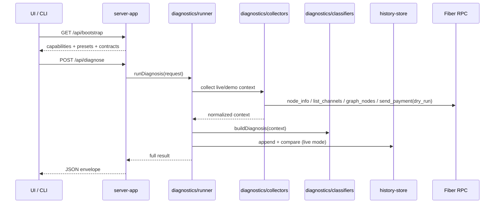

# Architecture

FiberOps is structured as a thin UI plus HTTP shell around a reusable diagnostics package.

## Component diagram

```mermaid
flowchart LR
  UI[Browser UI\npublic/index.html\npublic/app.js] --> API[server-app\nsrc/lib/server-app.js]
  CLI[CLI\nsrc/cli.js] --> DIAG[Diagnostics package\nsrc/lib/diagnostics]
  API --> DIAG
  DIAG --> RPC1[Fiber RPC node1]
  DIAG --> RPC2[Fiber RPC node2]
  DIAG --> HIST[History store\nsrc/lib/history-store.js]
  API --> CONTRACTS[/api/contracts/diagnose*]
```

## Request and data flow



## How diagnosis is computed

1. `runner.js` selects `demo` or `live` execution.
2. `collectors.js` gathers node snapshots and optional dry-run route evidence.
3. `classifiers.js` converts evidence into a category, headline, explanation, actions, and references.
4. `summaries.js` shapes readiness, monitoring, and comparison fields.
5. `engine.js` keeps the route-preview façade and assembles route-readiness output.
6. `events.js`, `history.js`, and `recommendations.js` attach event envelopes, history transitions, and operator alerts.
7. `adapters.js` exports the canonical result into `machine`, `operator`, `backend`, and `wallet` views.

## Current module seams

- `src/lib/server-app.js` — HTTP entrypoint, envelopes, contract endpoints, bootstrap payload
- `src/lib/diagnostics/runner.js` — orchestration and result assembly
- `src/lib/diagnostics/collectors.js` — live RPC collection and node aggregation
- `src/lib/diagnostics/classifiers.js` — diagnosis and invoice classification
- `src/lib/diagnostics/summaries.js` — summary/readiness shaping
- `src/lib/diagnostics/events.js` — event envelope generation
- `src/lib/diagnostics/history.js` — cross-run comparison and persistence-facing insights
- `src/lib/diagnostics/recommendations.js` — alerting and recommendation shaping
- `src/lib/diagnostics/contracts.js` — request/result/export schema publication and validation

## Notes

- `engine.js` owns route-preview composition so route proof, readiness, and history enrichment stay aligned across UI, CLI, and HTTP outputs.
- Result schemas are intentionally additive for compatibility. Validation checks required fields but does not freeze every nested property.
