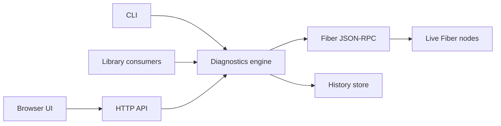
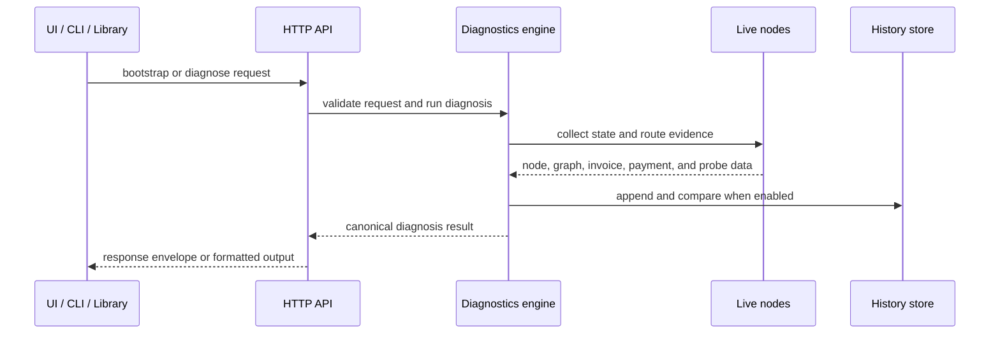

# FiberOps Developer Guide

FiberOps is the diagnostics engine and repository behind Fiber Desktop, a read-only operator console for Fiber on CKB. It gives operators, integrators, and contributors a consistent way to inspect routing readiness, payment failures, and multi-node behavior without sending live payments.

## Related docs

- [README](../README.md)
- [Architecture](./architecture.md)
- [Contracts](./contracts.md)
- [Runtime model](./runtime-model.md)
- [Failure modes](./failure-modes.md)
- [Local lab runbook](./local-lab-runbook.md)
- [VPS judging deployment](./vps-judging-deploy.md)
- [End-to-end validation](./e2e-validation.md)

## Overview

FiberOps turns low-level Fiber signals into an operator-facing explanation. Instead of asking a user to manually compare channel state, graph visibility, invoice data, payment status, and route probing results, FiberOps assembles that evidence into a single diagnosis with clear summaries, route-readiness signals, alerts, and next actions.

The platform is intentionally read-only. Its job is to explain network and payment conditions, not to act as a wallet or execute live payments on a user's behalf.

## Who this guide is for

This guide is for readers who need to understand FiberOps as a product surface and integration target.

- **Contributors** who are extending the browser UI, diagnostics engine, or operational workflows
- **Integrators** who want to consume the HTTP API, CLI, or library exports
- **Reviewers and operators** who need a reliable mental model for how FiberOps gathers evidence and presents conclusions

If you want contract details, read [Contracts](./contracts.md). If you want operational setup and validation flows, use the [Local lab runbook](./local-lab-runbook.md) and [End-to-end validation](./e2e-validation.md).

## Architecture at a glance

FiberOps is organized around one diagnostics engine exposed through multiple product surfaces.



The key architectural principle is consistency: the browser UI, API, CLI, and library exports all rely on the same underlying diagnosis model. That keeps failure classification, route-readiness reporting, and comparison behavior aligned across every surface.

## Product surfaces

### Browser UI

The browser UI is the operator-facing desktop shell. It is optimized for guided demos, interactive troubleshooting, and side-by-side comparison of live-node perspectives.

The current shell emphasizes a small core navigation set:

- `Overview`
- `Nodes`
- `Payments`
- `Routes`
- `Diagnostics`
- `Settings`

Supporting investigation tools such as `Simulations`, `Activity`, `Logs`, and `Reports` are still part of the product, but they are treated as supporting flows rather than the main navigation spine.

From a documentation standpoint, this matters because the UI is no longer best explained as "a dashboard with many equal tabs". It is a workflow-oriented desktop client:

1. understand what changed
2. identify the affected sender or payment
3. explain the failure
4. compare against history or a known-good baseline
5. prove the same result against live nodes when needed

### HTTP API

The HTTP API exposes FiberOps as an integration surface for backend systems, demos, and tooling. It provides bootstrap discovery, diagnosis execution, health state, metrics, and published contract metadata.

### CLI

The CLI provides the same diagnosis flow for scripts, automation, and terminal-based workflows. It is useful when a browser is unnecessary or when diagnosis results need to fit into a larger shell-based toolchain.

### Library exports

Library exports make the diagnostics engine reusable from other Node.js applications. This is the lowest-level supported integration path and is intended for projects that want direct programmatic access to request validation, diagnosis execution, and output formatting.

## Data flow

FiberOps uses one canonical diagnosis pipeline regardless of entry point.



At a high level, FiberOps:

1. accepts a request in demo or live mode
2. validates the request against the published contract
3. collects available evidence from fixtures or live nodes
4. classifies the outcome into an operator-facing diagnosis
5. assembles summaries, route previews, alerts, events, and optional history insights
6. returns the canonical result or an adapted output mode

## Network flow

In live mode, FiberOps gathers read-only network evidence from Fiber JSON-RPC endpoints. The system may inspect node information, channel state, graph visibility, invoice data, payment state, route-construction results, and dry-run route probes.

That evidence is interpreted through the runtime model documented in [Runtime model](./runtime-model.md). In particular, FiberOps distinguishes between:

- **Real** evidence from live node reads or live dry-run route probing
- **Heuristic** evidence inferred from channel, graph, invoice, or payment context
- **Fixture** evidence supplied by deterministic demo scenarios

This distinction is central to the product. FiberOps is designed to explain what it knows, how it knows it, and where confidence stops.

## API model

FiberOps serves a JSON API with explicit response envelopes.

### Success envelope

```json
{
  "ok": true,
  "data": {},
  "meta": {}
}
```

### Error envelope

```json
{
  "ok": false,
  "error": {
    "code": "INVALID_REQUEST",
    "message": "Invalid diagnosis request.",
    "details": {}
  },
  "meta": {}
}
```

The main API surfaces are:

- `GET /api/bootstrap`
- `POST /api/diagnose`
- `GET /api/health`
- `GET /api/metrics`
- `GET /api/contracts/diagnose`
- `GET /api/contracts/diagnose/request`
- `GET /api/contracts/diagnose/result`
- `GET /api/contracts/diagnose/rules`

The compatibility model is additive. Consumers should depend on the required top-level structure while allowing nested sections to grow over time. For full details, see [Contracts](./contracts.md).

## Configuration

FiberOps supports local defaults, explicit overrides, and environment-based configuration.

Common configuration areas include:

- bind host and port for the HTTP server
- primary and secondary Fiber RPC endpoints
- explicit live-node set configuration
- history-store path
- JSON body-size limits
- policy flags for external live endpoints
- policy flags for insecure token forwarding
- route-probe enablement

The project ships local templates in `.env.example` and `examples/live-node-set.json`.

From a product perspective, the most important configuration idea is policy: FiberOps defaults toward safe local usage and requires explicit opt-in for riskier live-network behaviors.

The desktop shell also supports `Auto`, `Light`, and `Dark` theme modes. These are UI-only preferences and do not change diagnostics behavior.

## Node management

FiberOps treats live nodes as diagnostic perspectives rather than as infrastructure it owns.

A deployment can diagnose through a single configured node or compare multiple live nodes in one run. When multiple nodes are present, FiberOps keeps a primary perspective for the top-level request while also surfacing cross-node differences that matter for operator decisions.

This matters because route readiness is sender-specific. A payment path can appear healthy from one node and blocked from another. FiberOps is designed to surface that disagreement rather than collapsing it into a single network-wide guess.

For local development and demos, the bundled lab provides a repeatable two-node environment. See the [Local lab runbook](./local-lab-runbook.md) for the operational flow.

For a hosted judging setup, use the VPS deployment flow documented in [VPS judging deployment](./vps-judging-deploy.md). That path keeps Fiber RPC private while exposing FiberOps publicly.

## Diagnostics model

The diagnostics engine converts collected evidence into operator-facing categories, summaries, and actions.

Representative categories include:

- `rpc_unavailable`
- `rpc_unauthorized`
- `rpc_invalid_response`
- `invalid_invoice`
- `invoice_expired`
- `no_open_channels`
- `channel_not_ready`
- `target_not_in_graph`
- `insufficient_liquidity`
- `route_unavailable`
- `payment_inflight`
- `success`

The failure taxonomy and expected operator actions are documented in [Failure modes](./failure-modes.md).

FiberOps also preserves the evidence model around route readiness. A route preview may be backed by Real, Heuristic, or Fixture evidence, and the result surface is expected to communicate that distinction clearly.

## Live testing

FiberOps supports both deterministic demo validation and opt-in live-node validation.

The standard local workflow is:

```bash
npm ci
npm run lab:reset
npm run lab:prepare
npm run lab:check
npm run dev
```

From there, validation can continue through browser smoke tests, API checks, full repository checks, or optional live-lab tests. The authoritative validation paths are documented in [End-to-end validation](./e2e-validation.md).

For presentations, the desktop now includes deterministic one-click demo scenarios in `Simulations`:

- Healthy Payment
- Low Liquidity
- Offline Node
- Fee Budget Too Low
- Route Not Found

These are designed to support a story-first walkthrough instead of a tab-by-tab UI tour. See [Judge demo narrative](./judge-demo.md).

## Deployment

FiberOps currently centers on local and lab-hosted deployments rather than a committed public hosted environment.

A practical deployment needs:

- Node.js and npm runtime support
- access to the intended Fiber JSON-RPC endpoints
- any required read-scoped authentication tokens
- a decision on whether history storage is enabled
- a clear policy for local-only versus external live endpoints

If FiberOps is deployed beyond a trusted local lab, review request policy, token handling, filesystem permissions for the history store, and any reverse-proxy behavior in front of the API.

## Troubleshooting

Most troubleshooting falls into four groups:

### API issues

If the API rejects a request, confirm the payload matches the published request schema and that the client is calling the correct route with the correct HTTP method.

### RPC issues

If Fiber RPC is unavailable or unauthorized, verify endpoint reachability, node health, and any read-scoped bearer token configuration.

### Route diagnosis issues

If a diagnosis reports invalid invoices, expired invoices, missing graph visibility, insufficient liquidity, or unavailable routes, use the failure taxonomy to distinguish between sender-state, network-state, and input-quality problems.

### Persistence issues

History storage is optional. A history failure should degrade comparison features without blocking diagnosis itself.

## Future extensions

FiberOps has clear extension points in product terms:

- richer diagnosis categories and rule coverage
- additional output modes and integration adapters
- deeper multi-node visualization
- stronger historical baselining and comparison
- more production-style deployment examples
- broader validation coverage for live and degraded paths

The important constraint is that future work should preserve the core product promises: read-only diagnostics, explicit evidence tiers, stable top-level contracts, and consistent behavior across UI, API, CLI, and library surfaces.

## Implementation references appendix

This guide keeps implementation references out of the main prose. If you need to trace the current code layout, these files are the main entry points:

- `src/lib/server-app.js`
- `src/cli.js`
- `src/lib/diagnostics/`
- `src/lib/diagnostics/runner.js`
- `src/lib/diagnostics/collectors.js`
- `src/lib/diagnostics/engine.js`
- `src/lib/diagnostics/contracts.js`
- `src/lib/history-store.js`
- `src/lib/history-backend.js`
- `src/lib/observability.js`
